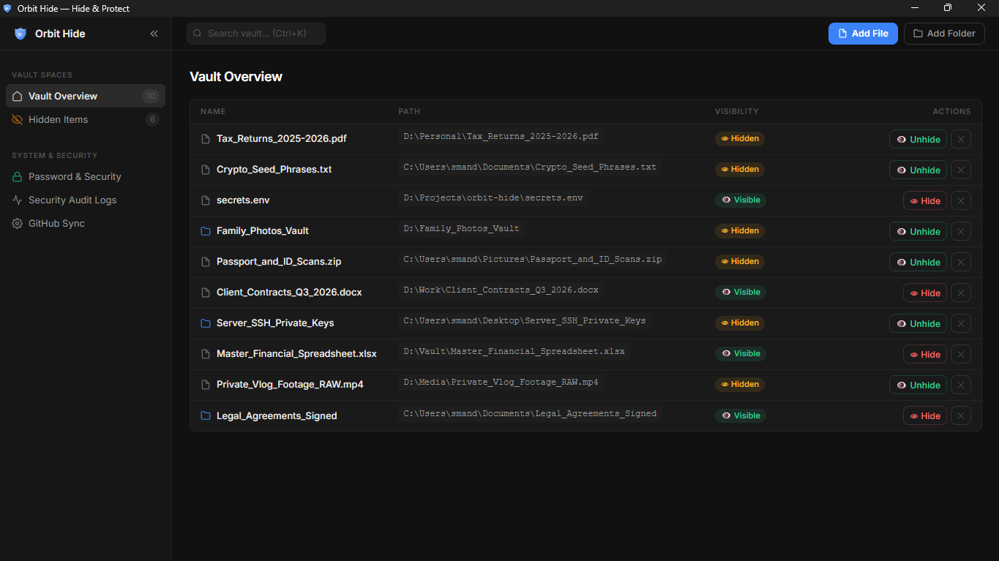
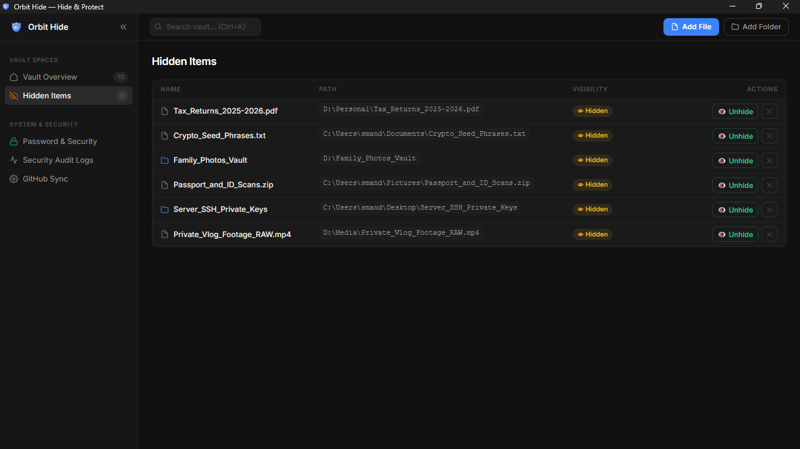
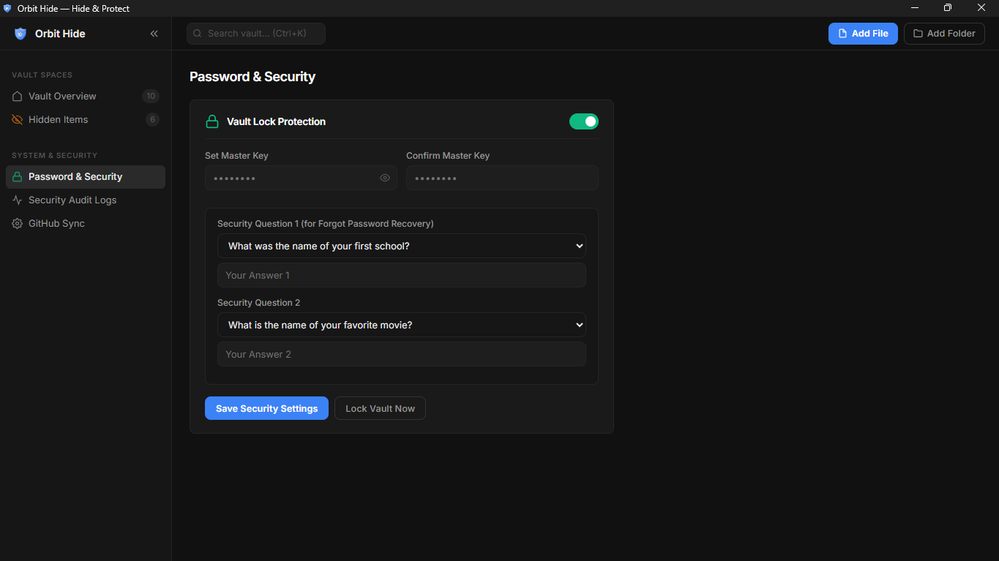
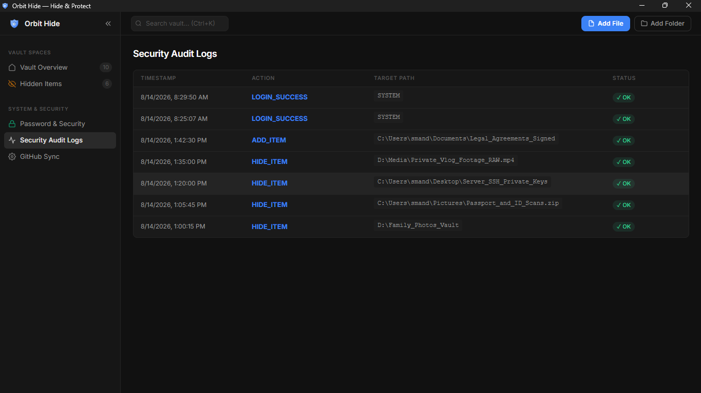
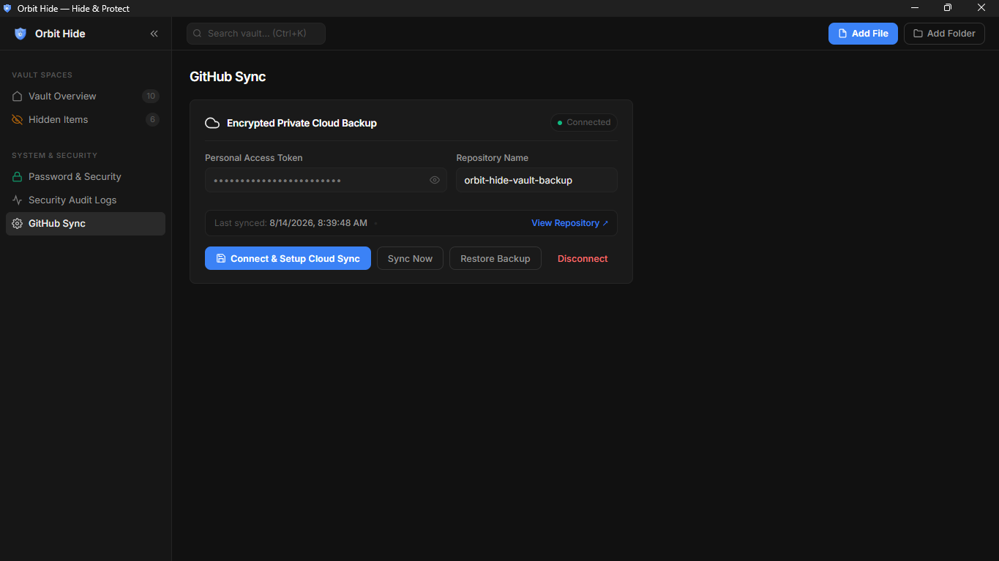

# Orbit Hide — Instant Windows File & Folder Protection

  

  # 🛡️ ORBIT HIDE
  **Ultra-Fast, Zero Data-Loss Protection & Hiding for Windows Files & Folders**

  
  
  
  
  

  ---

  

    <b>Orbit Hide</b> is a state-of-the-art local security utility designed to instantly hide sensitive files and folders in Windows File Explorer using kernel-level stealth attributes (<code>+h +s</code>), optional Master Key password protection, security question recovery, and encrypted GitHub cloud backup — 100% offline by default.
  

## 📸 Screenshots

### 🗂️ Vault Overview Dashboard

 

| 👁️ Hidden Items View | 🔑 Password & Security |
| :---: | :---: |
|  |  |

 

| 📋 Security Audit Logs | ☁️ Encrypted GitHub Cloud Sync |
| :---: | :---: |
|  |  |

---

## 🌟 Key Features

### 👁️ Stealth Attribute Protection (`+h +s`)
Unlike risky encryption tools that modify your file contents, **Orbit Hide** applies Windows Kernel-Level **System (`+s`)** and **Hidden (`+h`)** flags.
* **0% Data Corruption:** Original photos, videos, documents, and archives remain 100% untouched.
* **Instant Speed:** Hides and unhides files/folders in under **50 milliseconds**.

### 🖱️ Right-Click Windows Explorer Integration
Right-click any file or folder in Windows Explorer and click **`Hide with Orbit Hide`**.
* **Pure Stealth Hiding:** Executes 100% silently in the background with **zero window popups**.
* **Zero Configuration:** Automatically registers into Windows Registry (`HKCU`) on first launch — no admin prompt required.

### 🔑 Master Key & Security Questions Recovery
* **Optional Password Protection:** Lock your vault with a custom Master Key. Can be enabled or disabled any time.
* **PBKDF2 + SHA-512 Hashing:** Your master key is hashed with 100,000 iterations + 16-byte random salt.
* **Security Questions Recovery:** Forgot your password? Answer 2 secret security questions to reset your master key instantly.

### ☁️ Encrypted GitHub Cloud Backup
* Connect your private GitHub repository to keep an AES-256-CBC encrypted backup of your vault.
* Auto-sync on every change. Restore from any device with your GitHub token and master password.

### 🛡️ 100% Offline & Local Vault
* All configuration stays 100% locally inside `%APPDATA%\Orbit Hide\vault_db.json`.
* Internet is only used if you explicitly enable optional Cloud Sync.

---

## 📊 Feature Matrix

| Feature | Orbit Hide | Standard Encryption | Basic Windows Hide |
| :--- | :---: | :---: | :---: |
| **Data Safety (0% Corruption Risk)** | ✅ **100% Safe** | ⚠️ File Risk | ✅ Safe |
| **Speed** | ⚡ **Instant (<50ms)** | 🐢 Slow (Re-encrypts) | ⚡ Instant |
| **Right-Click Stealth Menu** | ✅ **Included** | ❌ No | ❌ No |
| **Zero Window Popups** | ✅ **Pure Stealth** | ❌ No | ❌ No |
| **Offline Security** | 🔒 **100% Offline** | ⚠️ Varies | 🔒 Local |
| **Password Protection (Optional)** | ✅ **Included** | ✅ Yes | ❌ No |
| **Password Recovery (Q&A)** | ✅ **Included** | ❌ Hard | ❌ No |
| **Encrypted Cloud Backup** | ✅ **GitHub Private Repo** | ❌ No | ❌ No |
| **Security Audit Logs** | ✅ **Built-in** | ❌ No | ❌ No |

---

## 📦 Downloads & Installation

Download the latest version directly from the [GitHub Releases](https://github.com/sachinmandawi/orbit-hide/releases) page:

* 🚀 **[Orbit Hide Setup 1.0.0.exe](https://github.com/sachinmandawi/orbit-hide/releases/download/v1.0.0/Orbit.Hide.Setup.1.0.0.exe)** — Official Windows Installer (recommended).
* 📦 **[Orbit Hide Portable 1.0.0.exe](https://github.com/sachinmandawi/orbit-hide/releases/download/v1.0.0/Orbit.Hide.1.0.0.exe)** — Portable Executable, no installation required.

---

## 🚀 Getting Started

1. Download and run the installer (or portable EXE).
2. The app opens directly to your **Vault Overview**.
3. Click **Add File** or **Add Folder** to add items to your vault.
4. Click **👁 Hide** to instantly hide any item from Windows Explorer.
5. *(Optional)* Go to **Password & Security** in the sidebar to set a Master Key.
6. *(Optional)* Go to **GitHub Sync** to enable encrypted cloud backup.

---

## ⌨️ Keyboard Shortcuts

| Shortcut | Description |
| :--- | :--- |
| `Ctrl + K` | Focus search bar to instantly find any item in vault |
| `Ctrl + \` | Toggle sidebar collapse/expand |
| `Enter` | Submit login or password recovery form |

---

## 🛠️ Tech Stack & Architecture

* **Desktop Framework:** Electron.js v31
* **Backend Server:** Node.js Express REST API
* **Security Hashing:** PBKDF2 with SHA-512 & Salt (Node.js `crypto` module)
* **Cloud Encryption:** AES-256-CBC (GitHub private repository backup)
* **OS Engine:** Windows Native Attributes (`attrib +h +s` / `attrib -h -s`)
* **Registry Integration:** Windows HKCU Shell Commands (`reg.exe`)
* **UI:** Vanilla HTML/CSS/JS with premium dark theme

---

## 📝 License

Distributed under the MIT License. See `LICENSE` for more information.

  Built with ❤️ for Privacy &amp; Security

